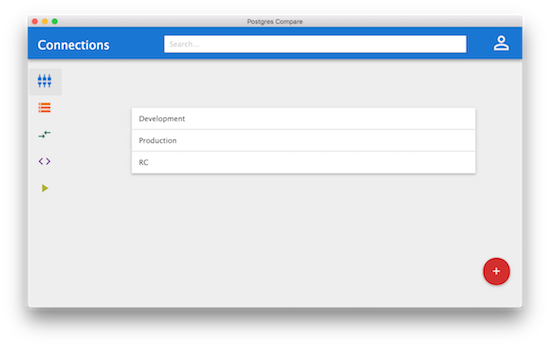

One of my (many) weaknesses is user interface design. There is something about the frontend that doesn't come naturally to me. At the same time I've witnessed first hand the impact a beautiful and intuitive UI can have on a user. A beautiful UI is easy on the eyes, users want to interact with it and they are more forgiving when something doesn't quite work.

I'm trying to create something different with Postgres Compare. Functional, fast and intuitive. Elements of a web app but primarily lives on the desktop. Often, while daydreaming about what might be, I have hit a brick wall as to how the UI might work. How can I save the user some setup time while also being flexible? How can I DRY up the work that Postgres Compare has to do so it never forgets? 

To work through these and so many other questions I've been building a prototype UI so I can get a feel for where some interactions might breakdown and also what the core engine would have to be capable of to make my dream application. I used [Electron](http://electron.atom.io) and a wonderful course from [Rob Conery](https://www.twitter.com/robconery) at [Pluralsight](https://app.pluralsight.com/library/courses/electron-playbook/table-of-contents) to produce the skeleton app linked below.

The process has really helped me work through the flows involved in [Postgres Compare](http://www.postgrescompare.com), but also aspects of the application's 'personality'. The colours, the icons, the animations. I want this app to be one of those that people love and being able to get my hands dirty with a prototype has helped me focus on the guiding principles I want it to live by!

* [Win64](https://drive.google.com/open?id=0B3SuQPH12XXtdUpyUmVnSDVROU0)
* [Mac](https://drive.google.com/open?id=0B3SuQPH12XXtMjNjX0ljNG4tblU)
* [Linux64](https://drive.google.com/file/d/0B3SuQPH12XXtSURZTG54cmNndWM/view?usp=sharing)
